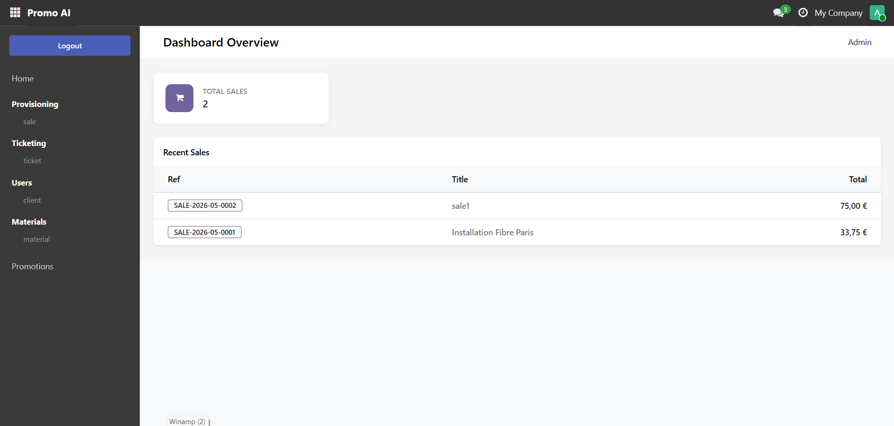

# 🚀 Promo AI — Odoo 19 Module

Complete Sales, Ticketing & Promotions management module built natively for **Odoo 19** with Docker and PostgreSQL.

> Odoo equivalent of the [Laravel 12 + Angular 19 CRUD project](https://github.com/ghyslain12/laravel-docker-apache-angular) — same business logic, same features, **Odoo mindset**: no REST API, no JWT, integrated frontend/backend via OWL + QWeb.

## ✨ Features

- **Materials** — Full CRUD with price management and archiving
- **Customers** — Linked to Odoo native users
- **Sales** — Title, description, customer, material lines with automatic pricing
- **Tickets** — Linked to sales, state workflow (New → In Progress → Resolved → Closed)
- **Promotions** — Three types: coupon code, global (all materials), material-specific
- **Automatic discounts** — Applied at sale creation based on promotion priority
- **PDF Invoice generation** — Localized templates: France (legal mentions) / International
- **Kanban Dashboard** — Sales overview with stats
- **Dark theme** — Custom CSS matching the Angular project visual identity
- **Custom login page** — Sidebar dark layout reproducing the Angular design
- **HTTP Controllers** — Optional JSON endpoints (session auth, no JWT)
- **GitHub Actions CI/CD** — 5-job pipeline: lint, validate, tests, Docker build, deploy
- **Unit & integration tests** — 7 test files, 65+ tests

## 📋 Tech Stack

**Backend:**
- Odoo 19 (Python ORM, QWeb, OWL)
- PostgreSQL 15
- Native session authentication (no JWT)

**Frontend:**
- Odoo Web Library (OWL) — reactive components
- QWeb — server-side + client-side templates
- Custom CSS dark theme

**Infrastructure:**
- Docker & Docker Compose
- pgAdmin 4
- GitHub Actions CI/CD

## 🔧 Prerequisites

- Docker Desktop (started)
- A web browser

## 📦 Installation

**1. Extract and enter the project:**
```bash
cd odoo-promo-ai
```

**2. Start containers (first time — downloads Odoo image ~400 MB):**
```bash
docker compose up -d --build
```

**3. Wait for Odoo to initialize (~60s), then open:**
```
http://localhost:8069
```

**4. Create the database:**
- Database name: `odoo_promo`
- Email: `admin@example.com`
- Password: `admin`
- ☑️ Load demonstration data

**5. Install the module:**
- Go to **Apps** → search `promo` → click **Install** on *Promo AI*

## 🌐 Available Services

| Service | URL | Description |
|---------|-----|-------------|
| **Odoo** | http://localhost:8069 | Main application |
| **pgAdmin** | http://localhost:5050 | PostgreSQL admin UI |
| **Odoo (longpolling)** | http://localhost:8072 | WebSocket / real-time |

## 🔐 Authentication

Odoo uses **native session authentication** — no JWT, no tokens to manage.

- Login via `/web/login`
- Session maintained server-side via cookie
- HTTP controllers require `auth='user'` (session check)

## 📡 HTTP Endpoints

All endpoints require a valid Odoo session (login first via `/web/login`).

### Materials
 **`/promo_ai/materials`** — List active materials

 **`/promo_ai/materials/<id>`** — Get material detail

### Sales
 **`/promo_ai/sales`** — List sales with summary

 **`/promo_ai/sales/<id>`** — Sale detail with lines and tickets

 **`/promo_ai/sales/<id>/invoice?country=france`** — Download PDF invoice

### Promotions
 **`/promo_ai/promotions`** — List active promotions

 **`/promo_ai/promotions/validate/<code>`** — Validate a coupon code

### Dashboard
 **`/promo_ai/dashboard/stats`** — KPI stats (JSON)

## 🎯 Promotion Priority Logic

When a sale is created or a material line is added, the best promotion is applied automatically:

```
1. Material-specific promotion  (highest priority)
2. Coupon code                  (when coupon_code supplied — before global)
3. Global promotion             (fallback)
```

## 🧪 Tests

```bash
# Via the helper script
bash run_tests.sh

# Or manually in Docker
docker exec -u odoo odoo_app \
  python /usr/bin/odoo \
  --config=/etc/odoo/odoo.conf \
  --test-enable \
  --stop-after-init \
  --log-level=test \
  --test-tags=/promo_ai \
  -d odoo_promo \
  -i promo_ai
```

**Test files:**

| File | Coverage |
|------|----------|
| `test_material.py` | CRUD, negative price constraint, archive |
| `test_customer.py` | CRUD, nickname uniqueness, sale count |
| `test_promotion.py` | Discount compute, state machine, priority logic |
| `test_sale.py` | Sequence generation, promo auto-apply, totals, coupon |
| `test_ticket.py` | State workflow, cascade delete |
| `test_invoice_wizard.py` | PDF generation wizard, empty sale error |
| `test_controllers.py` | HTTP endpoints, auth, 404 handling |

## 🛠️ Developer Commands

```bash
# Start (normal)
docker compose up -d

# Start (first time or after Dockerfile change)
docker compose up -d --build

# Follow logs
docker compose logs -f odoo

# Update module after code change
make update

# Open Odoo Python shell (like php artisan tinker)
make shell

# Run tests
make test

# Stop everything
docker compose down

# Full reset (destroys DB data)
docker compose down -v
```

## 📁 Module Structure

```
addons/promo_ai/
├── __manifest__.py          # Module declaration (name, version, dependencies, files)
├── models/
│   ├── material.py          # promo_ai.material → materials table
│   ├── customer.py          # promo_ai.customer → customers table
│   ├── promotion.py         # promo_ai.promotion + discount logic
│   ├── sale.py              # promo_ai.sale + promo_ai.sale.line (pivot)
│   └── ticket.py            # promo_ai.ticket + state workflow
├── views/                   # XML UI definitions (list, form, search, kanban, menus)
├── templates/               # Custom login page (QWeb)
├── report/                  # PDF invoice QWeb templates
├── wizards/                 # Generate invoice popup
├── controllers/             # HTTP JSON endpoints
├── security/
│   ├── ir.model.access.csv  # Model access rights (CRUD per group)
│   └── promo_ai_security.xml # Custom user groups
├── data/                    # Loaded on install: sequences
├── demo/                    # Loaded with demo data: materials, customers, sales...
├── static/src/
│   ├── css/promo_ai.css     # Dark theme override
│   └── js/dashboard.js      # OWL dashboard component
└── tests/                   # Unit + integration tests
```

## 🔄 CI/CD Pipeline

GitHub Actions runs on every push to `main` / `develop` and every pull request:

```
lint        → flake8 + Python syntax check
    ↓
validate    → manifest, XML files, security CSV, data files declared in manifest
    ↓
test        → Real Odoo 19 + PostgreSQL 15, full test suite
    ↓
docker      → Docker image build (main branch only)
    ↓
deploy      → SSH deploy to staging (configure secrets to enable)
```

Set these GitHub secrets/variables to enable staging deploy:
- `STAGING_HOST` — VPS IP or hostname
- `STAGING_SSH_KEY` — Private SSH key
- `STAGING_URL` — GitHub Environment variable

## 📊 Comparison: Laravel/Angular vs Odoo

| Concept | Laravel 12 + Angular 19 | Odoo 19 |
|---------|--------------------------|---------|
| Data model | Eloquent ORM (PHP) | ORM (Python) |
| Database | MySQL + PHP migrations | PostgreSQL, auto-managed |
| API | REST + JWT | JSON-RPC native (session) |
| Frontend | Angular 19 SPA | OWL + QWeb |
| Admin panel | Filament v4 | Odoo backend native |
| PDF generation | Groq AI | QWeb PDF native |
| Tests | Pest PHP | unittest Python |
| Cache | Redis | Odoo native cache |
| Auth | JWT token | Session cookie |

## 🐛 Troubleshooting

**Module not found in Apps list:**
```bash
docker exec -u odoo odoo_app \
  python /usr/bin/odoo --config=/etc/odoo/odoo.conf \
  -d odoo_promo --update=base --stop-after-init
```

**XML error on install:**
Check the error message for the file and line number. Validate locally:
```bash
python -c "import xml.etree.ElementTree as ET; ET.parse('addons/promo_ai/views/xxx.xml')"
```

**Sequence SALE- not generated:**
The sequence may be missing if the DB was created before `data/promo_ai_sequence.xml` was added. Fix with:
```bash
make update
```

**`_sql_constraints` deprecation warning:**
This is a warning, not an error — Odoo 19 still supports the old syntax while the new `models.Constraint` format is being adopted.

**WebSocket error in logs:**
```
RuntimeError: Couldn't bind the websocket. Is the connection opened on the evented port (8072)?
```
Add `workers = 0` in `docker/odoo.conf` to switch to single-thread mode (recommended for local dev).

## 📸 Screenshots


*Tickets list with dark sidebar*


*Dashboard*


*Sale form with material lines, discounts and ticket count*


*Generated PDF invoice*


*Custom login page matching Angular design*
