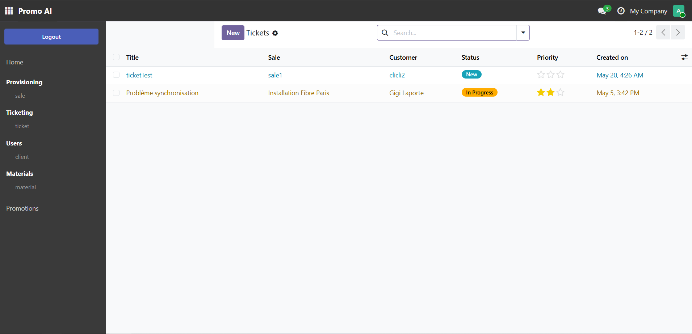
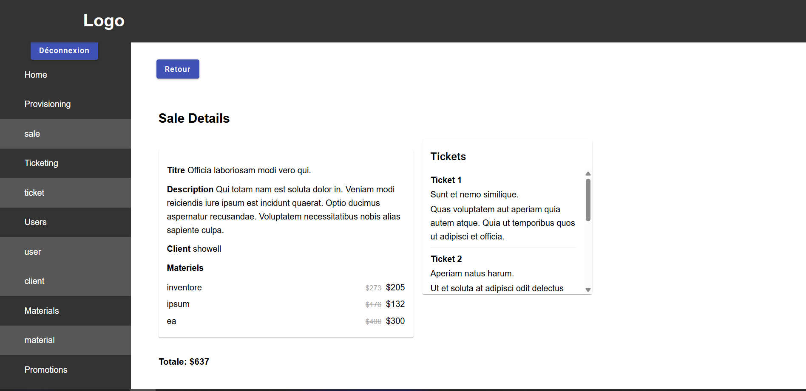
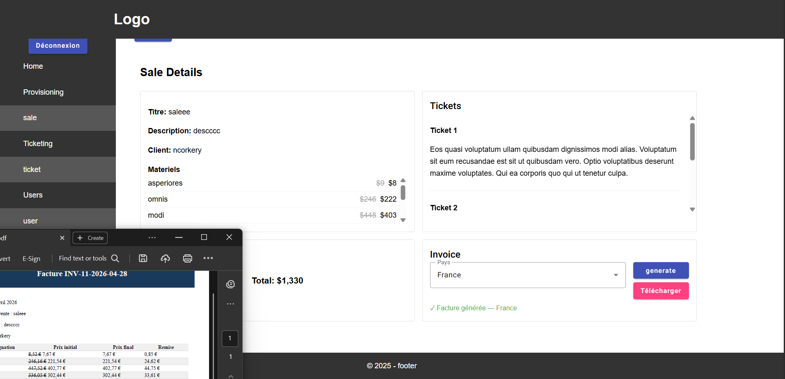
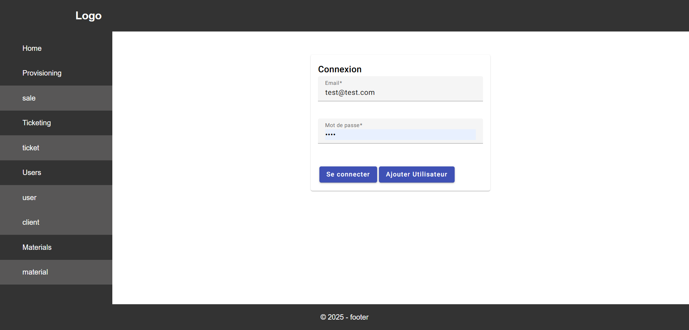

# 🚀 Promo AI — Module Odoo 19

Module complet de gestion des Ventes, Tickets & Promotions développé nativement pour **Odoo 19** avec Docker et PostgreSQL.

> Équivalent Odoo du [projet Laravel 12 + Angular 19](https://github.com/ghyslain12/laravel-docker-apache-angular) — même logique métier, mêmes fonctionnalités, **mindset Odoo** : pas d'API REST, pas de JWT, frontend/backend intégré via OWL + QWeb.

## ✨ Fonctionnalités

- **Matériels** — CRUD complet avec gestion des prix et archivage
- **Clients** — Liés aux utilisateurs natifs Odoo
- **Ventes** — Titre, description, client, lignes matériels avec tarification automatique
- **Tickets** — Liés aux ventes, workflow d'état (New → In Progress → Resolved → Closed)
- **Promotions** — Trois types : code coupon, globale (tous les matériels), par matériel
- **Remises automatiques** — Appliquées à la création de vente selon la priorité des promotions
- **Génération de facture PDF** — Templates localisés : France (mentions légales) / International
- **Dashboard Kanban** — Vue d'ensemble des ventes avec statistiques
- **Thème sombre** — CSS custom reproduisant l'identité visuelle du projet Angular
- **Page de login custom** — Sidebar sombre reproduisant le design Angular
- **Contrôleurs HTTP** — Endpoints JSON optionnels (auth session, sans JWT)
- **CI/CD GitHub Actions** — Pipeline 5 jobs : lint, validate, tests, Docker build, deploy
- **Tests unitaires & intégration** — 7 fichiers de tests, 65+ tests

## 📋 Stack Technique

**Backend :**
- Odoo 19 (Python ORM, QWeb, OWL)
- PostgreSQL 15
- Authentification session native (sans JWT)

**Frontend :**
- Odoo Web Library (OWL) — composants réactifs
- QWeb — templates server-side + client-side
- CSS dark theme custom

**Infrastructure :**
- Docker & Docker Compose
- pgAdmin 4
- GitHub Actions CI/CD

## 🔧 Prérequis

- Docker Desktop (démarré)
- Un navigateur web

## 📦 Installation

**1. Extraire et entrer dans le projet :**
```bash
cd odoo-promo-ai
```

**2. Démarrer les conteneurs (première fois — télécharge l'image Odoo ~400 Mo) :**
```bash
docker compose up -d --build
```

**3. Attendre l'initialisation d'Odoo (~60s), puis ouvrir :**
```
http://localhost:8069
```

**4. Créer la base de données :**
- Database name : `odoo_promo`
- Email : `admin@example.com`
- Password : `admin`
- ☑️ Load demonstration data

**5. Installer le module :**
- Aller dans **Apps** → chercher `promo` → cliquer **Install** sur *Promo AI*

## 🌐 Services Disponibles

| Service | URL | Description |
|---------|-----|-------------|
| **Odoo** | http://localhost:8069 | Application principale |
| **pgAdmin** | http://localhost:5050 | Interface admin PostgreSQL |
| **Odoo (longpolling)** | http://localhost:8072 | WebSocket / temps réel |

## 🔐 Authentification

Odoo utilise l'**authentification session native** — pas de JWT, pas de tokens à gérer.

- Connexion via `/web/login`
- Session maintenue côté serveur via cookie
- Les contrôleurs HTTP requièrent `auth='user'` (vérification session)

## 📡 Endpoints HTTP

Tous les endpoints nécessitent une session Odoo valide (se connecter d'abord via `/web/login`).

### Matériels
 **`/promo_ai/materials`** — Liste des matériels actifs

 **`/promo_ai/materials/<id>`** — Détail d'un matériel

### Ventes
 **`/promo_ai/sales`** — Liste des ventes avec résumé

 **`/promo_ai/sales/<id>`** — Détail d'une vente avec lignes et tickets

 **`/promo_ai/sales/<id>/invoice?country=france`** — Télécharger la facture PDF

### Promotions
 **`/promo_ai/promotions`** — Liste des promotions actives

 **`/promo_ai/promotions/validate/<code>`** — Valider un code coupon

### Dashboard
 **`/promo_ai/dashboard/stats`** — KPIs en JSON

## 🎯 Logique de Priorité des Promotions

Lors de la création d'une vente ou de l'ajout d'une ligne matériel, la meilleure promotion est appliquée automatiquement :

```
1. Promotion spécifique au matériel  (priorité maximale)
2. Code coupon                        (quand coupon_code fourni — avant le global)
3. Promotion globale                  (fallback)
```

## 🧪 Tests

```bash
# Via le script helper
bash run_tests.sh

# Ou manuellement dans Docker
docker exec -u odoo odoo_app \
  python /usr/bin/odoo \
  --config=/etc/odoo/odoo.conf \
  --test-enable \
  --stop-after-init \
  --log-level=test \
  --test-tags=/promo_ai \
  -d odoo_promo \
  -i promo_ai
```

**Fichiers de tests :**

| Fichier | Couverture |
|---------|-----------|
| `test_material.py` | CRUD, contrainte prix négatif, archivage |
| `test_customer.py` | CRUD, unicité surnom, compteur ventes |
| `test_promotion.py` | Calcul remises, machine d'états, priorité |
| `test_sale.py` | Génération séquence, promo auto, totaux, coupon |
| `test_ticket.py` | Workflow d'état, suppression en cascade |
| `test_invoice_wizard.py` | Wizard génération PDF, erreur vente vide |
| `test_controllers.py` | Endpoints HTTP, auth, gestion 404 |

## 🛠️ Commandes Utiles

```bash
# Démarrer (normal)
docker compose up -d

# Démarrer (première fois ou après changement Dockerfile)
docker compose up -d --build

# Suivre les logs
docker compose logs -f odoo

# Mettre à jour le module après un changement de code
make update

# Shell Python Odoo (comme php artisan tinker)
make shell

# Lancer les tests
make test

# Arrêter tout
docker compose down

# Reset complet (détruit les données DB)
docker compose down -v
```

## 📁 Structure du Module

```
addons/promo_ai/
├── __manifest__.py          # Déclaration du module (nom, version, dépendances, fichiers)
├── models/
│   ├── material.py          # promo_ai.material → table matériels
│   ├── customer.py          # promo_ai.customer → table clients
│   ├── promotion.py         # promo_ai.promotion + logique remises
│   ├── sale.py              # promo_ai.sale + promo_ai.sale.line (pivot)
│   └── ticket.py            # promo_ai.ticket + workflow d'état
├── views/                   # Définitions d'UI XML (list, form, search, kanban, menus)
├── templates/               # Page de login custom (QWeb)
├── report/                  # Templates QWeb facture PDF
├── wizards/                 # Popup génération de facture
├── controllers/             # Endpoints JSON HTTP
├── security/
│   ├── ir.model.access.csv  # Droits d'accès (CRUD par groupe)
│   └── promo_ai_security.xml # Groupes d'utilisateurs custom
├── data/                    # Chargé à l'installation : séquences
├── demo/                    # Chargé avec les données de démo : matériels, clients, ventes...
├── static/src/
│   ├── css/promo_ai.css     # Override thème sombre
│   └── js/dashboard.js      # Composant OWL dashboard
└── tests/                   # Tests unitaires + intégration
```

## 🔄 Pipeline CI/CD

GitHub Actions s'exécute à chaque push sur `main` / `develop` et chaque pull request :

```
lint        → flake8 + vérification syntaxe Python
    ↓
validate    → manifest, fichiers XML, CSV sécurité, fichiers data déclarés
    ↓
test        → Vrai Odoo 19 + PostgreSQL 15, suite de tests complète
    ↓
docker      → Build image Docker (branche main uniquement)
    ↓
deploy      → Déploiement SSH en staging (configurer les secrets pour activer)
```

Secrets/variables GitHub à configurer pour activer le déploiement :
- `STAGING_HOST` — IP ou hostname du VPS
- `STAGING_SSH_KEY` — Clé SSH privée
- `STAGING_URL` — Variable dans les paramètres GitHub Environment

## 📊 Comparaison : Laravel/Angular vs Odoo

| Concept | Laravel 12 + Angular 19 | Odoo 19 |
|---------|--------------------------|---------|
| Modèle de données | Eloquent ORM (PHP) | ORM (Python) |
| Base de données | MySQL + migrations PHP | PostgreSQL, auto-géré |
| API | REST + JWT | JSON-RPC natif (session) |
| Frontend | SPA Angular 19 | OWL + QWeb |
| Panel admin | Filament v4 | Backend Odoo natif |
| Génération PDF | IA Groq | QWeb PDF natif |
| Tests | Pest PHP | unittest Python |
| Cache | Redis | Cache natif Odoo |
| Authentification | Token JWT | Cookie session |

## 🐛 Dépannage

**Module introuvable dans la liste Apps :**
```bash
docker exec -u odoo odoo_app \
  python /usr/bin/odoo --config=/etc/odoo/odoo.conf \
  -d odoo_promo --update=base --stop-after-init
```

**Erreur XML à l'installation :**
Vérifier le message d'erreur pour le fichier et la ligne. Valider localement :
```bash
python -c "import xml.etree.ElementTree as ET; ET.parse('addons/promo_ai/views/xxx.xml')"
```

**La séquence SALE- n'est pas générée :**
La séquence peut être absente si la DB a été créée avant l'ajout de `data/promo_ai_sequence.xml`. Corriger avec :
```bash
make update
```

**Avertissement `_sql_constraints` déprécié :**
C'est un avertissement, pas une erreur — Odoo 19 supporte toujours l'ancienne syntaxe pendant la transition vers `models.Constraint`.

**Erreur WebSocket dans les logs :**
```
RuntimeError: Couldn't bind the websocket. Is the connection opened on the evented port (8072)?
```
Ajouter `workers = 0` dans `docker/odoo.conf` pour passer en mode single-thread (recommandé pour le dev local).

## 📸 Aperçus


*Liste des tickets avec sidebar sombre*


*CRUD Matériels*


*Formulaire vente avec lignes matériels, remises et compteur tickets*


*Facture PDF générée — localisation France*


*Page de login custom reproduisant le design Angular*
